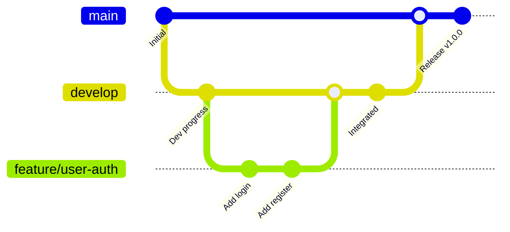

# Guia Completo GitFlow

Este documento explica em detalhes como utilizar o fluxo de trabalho GitFlow neste projeto.

## 🌿 Visão Geral do GitFlow

GitFlow é um modelo de branching que oferece um framework robusto para gerenciar projetos com releases programados. Ele define branches estritas para diferentes propósitos e um fluxo claro para integração e entrega.

## 📋 Estrutura de Branches

### Branches Principais

#### 🏷️ `main`
- **Propósito**: Branch de produção
- **Conteúdo**: Código estável e testado
- **Proteção**: Apenas merges de release/hotfix
- **Tags**: Cada release recebe uma tag semântica (v1.0.0, v1.1.0, etc.)

#### 🌿 `develop`
- **Propósito**: Branch de integração
- **Conteúdo**: Próxima release em desenvolvimento
- **Proteção**: Apenas merges de feature/bugfix
- **Base**: Source para branches de feature e release

### Branches de Suporte

#### ✨ `feature/*`
- **Propósito**: Desenvolvimento de novas funcionalidades
- **Origem**: `develop`
- **Destino**: `develop` (via Pull Request)
- **Nomeação**: `feature/descricao-descritiva`

#### 🐛 `bugfix/*`
- **Propósito**: Correção de bugs não críticos
- **Origem**: `develop`
- **Destino**: `develop` (via Pull Request)
- **Nomeação**: `bugfix/descricao-descritiva`

#### 🔥 `hotfix/*`
- **Propósito**: Correções críticas em produção
- **Origem**: `main`
- **Destino**: `main` e `develop`
- **Nomeação**: `hotfix/descricao-descritiva`

#### 📦 `release/*`
- **Propósito**: Preparação de release
- **Origem**: `develop`
- **Destino**: `main` e `develop`
- **Nomeação**: `release/vX.Y.Z`

## 🔄 Fluxos de Trabalho Detalhados

### 1. Ciclo de Vida de uma Feature



**Passos:**

1. **Iniciar Feature**
   ```bash
   git checkout develop
   git pull origin develop
   git checkout -b feature/user-authentication
   ```

2. **Desenvolver**
   ```bash
   # Trabalhar na funcionalidade
   git add .
   git commit -m "feat: add user authentication system"
   git push origin feature/user-authentication
   ```

3. **Finalizar Feature**
   ```bash
   # Abrir PR para develop
   # Após aprovação:
   git checkout develop
   git pull origin develop
   git merge --no-ff feature/user-authentication
   git push origin develop
   git branch -d feature/user-authentication
   ```

### 2. Ciclo de Vida de um Hotfix

```mermaid
gitGraph
    commit id: "v1.0.0"
    checkout main
    branch hotfix/security-patch
    checkout hotfix/security-patch
    commit id: "Fix vulnerability"
    
    checkout main
    merge hotfix/security-patch
    commit id: "v1.0.1"
    
    checkout develop
    merge hotfix/security-patch
    commit id: "Backported"
```

**Passos:**

1. **Identificar Problema Crítico**
   - Bug em produção
   - Vulnerabilidade de segurança
   - Falha crítica de performance

2. **Criar Hotfix**
   ```bash
   git checkout main
   git pull origin main
   git checkout -b hotfix/critical-security-fix
   ```

3. **Corrigir e Testar**
   ```bash
   # Correção rápida e focada
   git add .
   git commit -m "hotfix: fix SQL injection vulnerability"
   ```

4. **Aplicar Hotfix**
   ```bash
   # Para produção
   git checkout main
   git merge --no-ff hotfix/critical-security-fix
   git tag v1.0.1
   git push origin main --tags
   
   # Para develop (não perder a correção)
   git checkout develop
   git merge --no-ff hotfix/critical-security-fix
   git push origin develop
   
   # Limpar
   git branch -d hotfix/critical-security-fix
   ```

### 3. Ciclo de Vida de Release

```mermaid
gitGraph
    commit id: "Dev progress"
    checkout develop
    branch release/v1.1.0
    checkout release/v1.1.0
    commit id: "Bump version"
    commit id: "Update changelog"
    
    checkout main
    merge release/v1.1.0
    commit id: "v1.1.0"
    
    checkout develop
    merge release/v1.1.0
    commit id: "Forward merge"
```

**Passos:**

1. **Preparar Release**
   ```bash
   git checkout develop
   git pull origin develop
   git checkout -b release/v1.1.0
   ```

2. **Finalizar Release**
   - Atualizar número da versão
   - Atualizar CHANGELOG.md
   - Testes finais
   - Documentação

3. **Publicar Release**
   ```bash
   # Para main (produção)
   git checkout main
   git merge --no-ff release/v1.1.0
   git tag v1.1.0
   git push origin main --tags
   
   # Para develop (manter sincronia)
   git checkout develop
   git merge --no-ff release/v1.1.0
   git push origin develop
   
   # Limpar
   git branch -d release/v1.1.0
   ```

## 📝 Padrões e Convenções

### Nomenclatura de Branches

```bash
# ✅ Bom
feature/user-authentication
bugfix/login-validation-error
hotfix/security-vulnerability
release/v1.2.0

# ❌ Ruim
feature/userAuth
bugfix/fix_login
hotfix/urgent-fix
release/1.2.0
```

### Mensagens de Commit

Use [Conventional Commits](https://www.conventionalcommits.org/):

```bash
feat: add user authentication system
fix: resolve login validation error
docs: update API documentation
style: format code with prettier
refactor: simplify user service
test: add unit tests for auth controller
chore: update dependencies
hotfix: patch security vulnerability
release: prepare version 1.2.0
```

### Tags de Versão

```bash
# Formato semântico
vMAJOR.MINOR.PATCH

# Exemplos
v1.0.0    # Primeira release
v1.1.0    # Nova funcionalidade
v1.1.1    # Bug fix
v2.0.0    # Breaking changes
```

## 🛡️ Regras de Proteção

### Branch `main`
- **Required approvals**: 2
- **Enforce admins**: True
- **Required status checks**: Strict
- **Required teams**: maintainers, senior-developers

### Branch `develop`
- **Required approvals**: 1
- **Enforce admins**: False
- **Required status checks**: Normal
- **Required teams**: developers, maintainers

## 🔧 Comandos Úteis

### Situação Atual
```bash
# Ver branch atual
git branch --show-current

# Ver todas as branches
git branch -a

# Ver status completo
git status
```

### Sincronização
```bash
# Sincronizar com remoto
git fetch --all

# Atualizar branch atual
git pull

# Sincronizar todas as branches
git pull --all
```

### Limpeza
```bash
# Remover branches locais já merged
git branch --merged | grep -v "main\|develop" | xargs git branch -d

# Remover branches remotas já deletadas
git remote prune origin
```

### Resolução de Conflitos

```bash
# Durante merge com conflito
git status                    # Ver arquivos conflitantes
git add <arquivo>            # Marcar como resolvido
git commit                   # Finalizar merge

# Abortar merge
git merge --abort
```

## 🚨 Troubleshooting

### Problemas Comuns

#### 1. Branch desatualizada
```bash
git checkout develop
git pull origin develop
git checkout feature/sua-feature
git rebase develop
```

#### 2. Conflito de merge
```bash
# Opção 1: Abortar e começar de novo
git merge --abort

# Opção 2: Resolver manualmente
# Editar arquivos conflitantes
git add .
git commit
```

#### 3. Push rejeitado
```bash
# Branch local divergiu da remota
git fetch origin
git rebase origin/develop
git push --force-with-lease origin feature/sua-feature
```

#### 4. Esqueceu de fazer pull antes
```bash
# Stash suas alterações
git stash

# Pull das atualizações
git pull origin develop

# Aplicar suas alterações
git stash pop
```

### Boas Práticas

1. **Commits pequenos e atômicos**
2. **Pull requests descritivos**
3. **Testes automáticos antes do merge**
4. **Manter branches atualizadas**
5. **Deletar branches após o merge**
6. **Usar tags para releases**

## 📊 Métricas e Monitoramento

### KPIs do GitFlow
- **Tempo de vida das branches**: Quanto tempo uma branch fica aberta
- **Taxa de merge**: Percentual de PRs que são merged
- **Tempo de review**: Quanto tempo os PRs levam para ser revisados
- **Frequência de releases**: Quantas releases por mês

### Ferramentas de Visualização
- GitHub Insights
- GitKraken Globs
- SourceTree Graphs
- Custom dashboards

## 🔗 Recursos Adicionais

- [GitFlow Original](https://nvie.com/posts/a-successful-git-branching-model/)
- [Conventional Commits](https://www.conventionalcommits.org/)
- [GitHub Branch Protection](https://docs.github.com/en/repositories/configuring-branches-and-merges-in-your-repository/defining-the-mergeability-of-pull-requests/about-protected-branches)
- [Semantic Versioning](https://semver.org/)

---

**Nota**: Este guia deve ser seguido rigorosamente para manter a consistência e qualidade do projeto. Dúvidas devem ser direcionadas aos mantenedores.